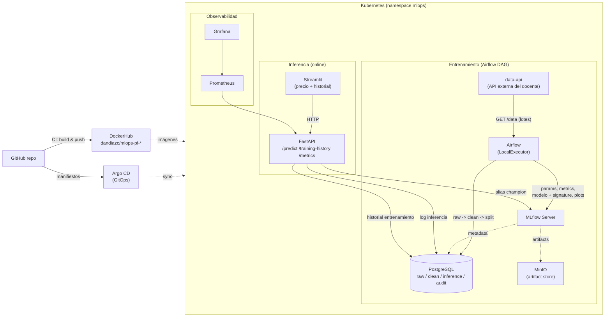
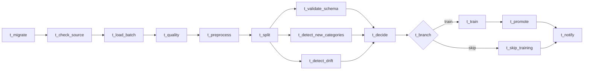

# MLOps — Estimador de Precio Inmobiliario (Proyecto Final)

Plataforma MLOps **end-to-end** sobre Kubernetes que predice el **precio de
propiedades inmobiliarias** (regresión), consumiendo los datos de una **API
externa** por lotes. Cubre el ciclo completo y operado por GitOps:

> ingesta desde API → RAW/CLEAN → calidad → **decisión automática de
> reentrenar** → entrenamiento + experimentación → promoción condicional →
> servicio de inferencia → UI → observabilidad → **CI/CD** → **GitOps (Argo CD)**.

A diferencia del proyecto anterior (clasificación de diabetes leyendo un CSV),
aquí la fuente es una **API HTTP stateful** que entrega lotes enormes
(70k–230k filas) y el pipeline **decide solo** si vale la pena reentrenar según
*data drift*, categorías nuevas y validación de esquema.

## Tabla de contenidos

- [Arquitectura](#arquitectura)
- [Capacidades cubiertas](#capacidades-cubiertas)
- [Componentes](#componentes)
- [Stack técnico](#stack-técnico)
- [Flujo del DAG](#flujo-del-dag)
- [Decisión automática de reentrenamiento](#decisión-automática-de-reentrenamiento)
- [API de inferencia](#api-de-inferencia)
- [UI](#ui)
- [Modelo de datos](#modelo-de-datos)
- [CI/CD (GitHub Actions)](#cicd-github-actions)
- [GitOps con Argo CD](#gitops-con-argo-cd)
- [Observabilidad](#observabilidad)
- [Despliegue](#despliegue)
- [Acceso a los servicios](#acceso-a-los-servicios)
- [Seguridad y secretos](#seguridad-y-secretos)
- [Decisiones técnicas](#decisiones-técnicas)
- [Dificultades encontradas](#dificultades-encontradas)
- [Estructura del repositorio](#estructura-del-repositorio)

## Arquitectura



**Dos fases separadas:**

- **Entrenamiento (offline):** un DAG de Airflow consume el siguiente lote de la
  API, lo persiste crudo (RAW) y procesado (CLEAN), calcula señales de drift /
  categorías nuevas / esquema, **decide si reentrenar**, y si entrena registra
  los candidatos en MLflow y promueve el mejor por **MAE** solo si mejora.
- **Inferencia (online):** la API resuelve el modelo `champion` en MLflow,
  responde precios estimados a la UI, registra cada llamada en
  `inference.predictions` y expone el historial de entrenamiento (`audit`).

## Capacidades cubiertas

Mapeo de los requisitos del enunciado a su implementación (los códigos RFn
coinciden con los comentarios del código):

| Capacidad | Dónde | Notas |
|---|---|---|
| **RF1** Ingesta desde API externa por lotes | [pipeline/ingest.py](pipeline/ingest.py) | Cliente `requests` con reintentos+backoff; maneja fin de datos sin fallar |
| **RF2** Separación RAW / CLEAN + trazabilidad | [pipeline/db/migrations.py](pipeline/db/migrations.py) | `raw.properties_raw` (JSONB) → `clean.properties_clean` (features+target) |
| **RF3** Categorías nuevas / alta cardinalidad | [pipeline/train.py](pipeline/train.py) | `OneHotEncoder(handle_unknown="infrequent_if_exist", min_frequency, max_categories)` dentro del Pipeline |
| **RF4** Decisión automática de reentrenar | [pipeline/decision.py](pipeline/decision.py) | esquema + categorías nuevas + **drift PSI** → bifurcación `train`/`skip` |
| **RF5** Experimentación + artefactos | [pipeline/train.py](pipeline/train.py) | Ridge + HistGBR en MLflow; plots predicho-vs-real y residuales; tag con el motivo |
| **RF6** Promoción condicional | [pipeline/promote.py](pipeline/promote.py) | promueve solo si MAE mejora ≥3% y RMSE no empeora >1% |
| **RF7** Orquestación reproducible | [airflow/dags/diabetes_training_dag.py](airflow/dags/diabetes_training_dag.py) | DAG idempotente con XCom y `@task.branch` |
| **RF8** Log de inferencias | [api/db.py](api/db.py) | cada `/predict` (ok **y** error) → `inference.predictions` |
| **RF9** Historial de entrenamiento en UI | [api/main.py](api/main.py) · [ui/app.py](ui/app.py) | `GET /training-history` lee `audit.training_history`; pestaña en Streamlit |
| **CI/CD** | [.github/workflows/](.github/workflows/) | build & push de las 3 imágenes por SHA |
| **GitOps** | [k8s/argocd/](k8s/argocd/) | Argo CD App-of-Apps con autocuración |

## Componentes

| Componente | Tecnología | Imagen | Propósito |
|---|---|---|---|
| API de datos | (del docente) | `cristiandiaz13/mlops-puj:data-api-pf-v1` | Fuente de los lotes inmobiliarios (no se reconstruye) |
| Orquestador | Apache Airflow 3.1.8 | `dandiazc/mlops-pf-airflow` | DAG con decisión de reentrenar; embebe `pipeline/` y los DAGs |
| BD relacional | PostgreSQL 16 | `postgres:16` | Schemas `raw`, `clean`, `inference`, `audit` + DB `mlflow`, `airflow` |
| Artifact store | MinIO | `minio/minio` | Bucket `mlflow-artifacts` |
| Registro ML | MLflow 2.16.0 | `dandiazc/mlops-mlflow` | Backend PG + artifacts S3-compatible |
| API inferencia | FastAPI + uvicorn | `dandiazc/mlops-pf-api` | `/predict /training-history /model-info /reload-model /metrics` |
| UI | Streamlit | `dandiazc/mlops-pf-ui` | Formulario de propiedad + historial de entrenamiento |
| Métricas | Prometheus | `prom/prometheus` | Scrape vía anotaciones del pod |
| Dashboards | Grafana | `grafana/grafana` | Latencias p50/p95/p99, RPS, distribución de precio |
| Pruebas de carga | Locust | `locustio/locust` | Escenario contra `/predict` |
| GitOps | Argo CD | `quay.io/argoproj/argocd` | Sincroniza `k8s/` desde el repo |

> Las imágenes propias del Proyecto Final usan el prefijo **`dandiazc/mlops-pf-*`**
> y las publica el CI por SHA — no se sobrescriben las del proyecto anterior.

## Stack técnico

| Capa | Versiones |
|---|---|
| Runtime | Python 3.11 (API/UI), 3.12 (Airflow base) |
| ML | scikit-learn 1.4.2, numpy 2.4.2, pandas 2.2.2 (paridad train↔serve) |
| Modelos | `Ridge` + `HistGradientBoostingRegressor`, envueltos en `TransformedTargetRegressor` (log1p/expm1) |
| Métrica de promoción | **MAE** (menor es mejor); se reportan MAE/RMSE/MAPE/R² |
| Persistencia | PostgreSQL 16 (StatefulSet + PVC), MinIO (StatefulSet + PVC) |
| Despliegue | kustomize + Argo CD (GitOps); Airflow vía Helm chart oficial |
| CI/CD | GitHub Actions → DockerHub |

## Flujo del DAG



| Tarea | Módulo | Qué hace |
|---|---|---|
| `t_migrate` | `pipeline/db/migrations.py` | DDL idempotente (raw/clean/inference/audit) |
| `t_check_source` | `pipeline/ingest.py` | `GET /health` de la API de datos |
| `t_load_batch` | `pipeline/ingest.py` | trae el siguiente lote → `raw.properties_raw` (idempotente por `row_hash`) |
| `t_quality` | `pipeline/quality.py` | valida columnas/target; corta si hay problemas críticos |
| `t_preprocess` | `pipeline/preprocess.py` | **incremental**: solo filas nuevas → `clean.properties_clean` |
| `t_split` | `pipeline/split.py` | **incremental**: asigna 70/15/15 a las filas nuevas |
| `t_validate_schema` | `pipeline/decision.py` | features esperadas presentes |
| `t_detect_new_categories` | `pipeline/decision.py` | categóricas no vistas vs histórico (SQL `EXCEPT`) |
| `t_detect_drift` | `pipeline/decision.py` | **PSI** por feature numérica + target |
| `t_decide` | `pipeline/decision.py` | cruza señales → `train` o `skip` con motivo |
| `t_branch` | DAG (`@task.branch`) | dirige el flujo a una u otra rama |
| `t_train` | `pipeline/train.py` | entrena Ridge + HistGBR; registra en MLflow |
| `t_promote` | `pipeline/promote.py` | promueve el mejor por MAE si supera al champion |
| `t_skip_training` | DAG | no-op (rama de "no entrenar") |
| `t_notify` | `pipeline/audit.py` | escribe la corrida en `audit.training_history` (ambas ramas) |

El DAG es **idempotente**: `row_hash` UNIQUE en raw, upserts en clean, runs de
MLflow append-only; cualquier reintento de Airflow es seguro.

## Decisión automática de reentrenamiento

En vez de reentrenar a ciegas, [pipeline/decision.py](pipeline/decision.py)
calcula tres señales sobre el lote nuevo y decide:

1. **Validación de esquema** — el lote trae todas las features esperadas.
2. **Categorías nuevas** — valores categóricos no vistos en el histórico
   (comparación exacta con `EXCEPT` en SQL).
3. **Data drift (PSI)** — Índice de Estabilidad de Población por feature numérica
   y target (umbral 0.25 = cambio significativo).

Reglas de `decide()` (en orden): esquema inválido → *skip*; sin champion →
*train* (línea base); 0 filas nuevas → *skip*; drift significativo → *train*;
categorías nuevas → *train*; lote grande → *train*; en otro caso → *skip*. Todo
queda registrado en `audit.training_history` con su motivo.

## API de inferencia

FastAPI ([api/main.py](api/main.py)):

| Método | Endpoint | Descripción |
|---|---|---|
| GET | `/health` | liveness/readiness |
| GET | `/model-info` | nombre/versión/alias del modelo en caché |
| POST | `/predict` | `{"features": {...}}` → `{prediction (precio), model_*, request_id, processing_time_ms}` |
| GET | `/training-history?limit=N` | últimas corridas de `audit.training_history` (RF9) |
| POST | `/reload-model` | fuerza recarga del champion (tras una promoción) |
| GET | `/metrics` | métricas Prometheus |

- **Carga del modelo**: pre-carga en startup + cache con TTL (300s) + recarga
  manual ([api/model_loader.py](api/model_loader.py)).
- **Coerción de esquema** ([api/main.py](api/main.py) `_coerce_to_schema`): el
  cliente puede mandar `bed` como int o `prev_sold_year` como float; la API
  ajusta los dtypes a la firma del modelo (MLflow valida el esquema de forma
  estricta y la firma tiene tipos mixtos).
- **Log de inferencias** (RF8): cada `/predict`, exitoso o fallido, se inserta
  en `inference.predictions` con `status` (`ok`/`error`) y latencia.

## UI

Streamlit ([ui/app.py](ui/app.py)) con dos pestañas:

- **Predicción de precio** — formulario de propiedad (bed, bath, acre_lot,
  house_size, prev_sold_year, status, city, state, zip_code) → precio estimado.
- **Historial de entrenamiento** (RF9) — tabla con cada corrida: decisión,
  motivo, si entrenó/promovió, MAE del candidato vs champion, drift y categorías
  nuevas. La UI **solo** habla con la API (no importa mlflow ni psycopg2).

## Modelo de datos

Cuatro schemas en PostgreSQL ([pipeline/db/migrations.py](pipeline/db/migrations.py)):

- **`raw.properties_raw`** — lote tal cual de la API: `row_hash` (PK, idempotencia),
  `batch_id`, `source`, `status`, `payload` (JSONB).
- **`clean.properties_clean`** — `features` (JSONB), `target` (`DOUBLE`, precio),
  `split`, FK a raw.
- **`inference.predictions`** — `prediction` (`DOUBLE`), `input_payload`,
  `model_version`, `status`, `error`, `latency_ms` (RF8).
- **`audit.training_history`** — una fila por corrida del DAG: decisión y motivo,
  drift, categorías nuevas, validaciones, métricas de candidato y champion,
  IDs de MLflow (RF4/RF9).

## CI/CD (GitHub Actions)

Dos workflows en [.github/workflows/](.github/workflows/) (detalle en su
[README](.github/workflows/README.md)):

- **`ci.yml`** (push/PR): compila `pipeline/ api/ ui/ scripts/` y verifica la
  **paridad de versiones** train↔serve (numpy/scikit-learn/mlflow/pandas).
- **`build-push.yml`** (push a `main` / manual): matrix que construye y publica
  `dandiazc/mlops-pf-{airflow,api,ui}` en DockerHub etiquetadas por **SHA** y
  `latest`, con buildx + cache. Reemplaza los `docker build` manuales.

Secrets requeridos en el repo: `DOCKERHUB_USERNAME`, `DOCKERHUB_TOKEN`.

## GitOps con Argo CD

Argo CD mantiene el cluster sincronizado con `k8s/` (patrón **App-of-Apps**,
detalle en [k8s/argocd/README.md](k8s/argocd/README.md)):

```bash
kubectl create namespace argocd
kubectl apply --server-side -n argocd \
  -f https://raw.githubusercontent.com/argoproj/argo-cd/stable/manifests/install.yaml
kubectl apply -f k8s/argocd/root-app.yaml      # bootstrap
```

La Application raíz despliega una Application por componente (con *sync-waves*
para el orden) y `automated: {prune, selfHeal}` → **autocuración**: cualquier
cambio manual en el cluster se revierte al estado de Git.

> Airflow se despliega con su Helm chart (fuera de Argo); puede integrarse como
> Application de tipo Helm más adelante.

## Observabilidad

- La API expone `/metrics` (vía `prometheus-fastapi-instrumentator` + counters
  propios en [api/metrics.py](api/metrics.py)): `inference_predictions_total`
  (por estado), `inference_predicted_price` (histograma), `inference_latency_seconds`,
  `inference_model_info`.
- Prometheus scrapea por anotaciones del pod; Grafana monta un dashboard con
  latencias, RPS, errores y distribución de precio.

## Despliegue

### Prerrequisitos
Docker Desktop con Kubernetes, `kubectl`, `helm`, `kustomize`.

### Opción A — GitOps (recomendada)
1. Instalar Argo CD (ver arriba).
2. `kubectl apply -f k8s/argocd/root-app.yaml` y dejar que Argo sincronice todo.
3. Desplegar Airflow (Helm):
   ```bash
   helm repo add apache-airflow https://airflow.apache.org
   helm upgrade --install airflow apache-airflow/airflow -n mlops -f airflow/values/values-local.yaml
   ```
4. Disparar el DAG `diabetes_mlops_pipeline` desde la UI de Airflow.

### Opción B — manual (kustomize)
```bash
kubectl apply -k k8s/foundations     # namespace + postgres + minio
kubectl apply -k k8s/mlflow
kubectl apply -k k8s/data-api
helm upgrade --install airflow apache-airflow/airflow -n mlops -f airflow/values/values-local.yaml
kubectl apply -k k8s/api && kubectl apply -k k8s/ui
kubectl apply -k k8s/prometheus && kubectl apply -k k8s/grafana && kubectl apply -k k8s/locust
```

> La API arranca sin servir hasta que el DAG promueva un `champion`. Es esperado.

## Acceso a los servicios

`kubectl -n <ns> port-forward svc/<svc> <local>:<port>`:

| Servicio | Comando | Credenciales |
|---|---|---|
| Streamlit UI | `-n mlops svc/ui 8501:8501` | — |
| API (Swagger) | `-n mlops svc/api 8000:8000` → `/docs` | — |
| MLflow | `-n mlops svc/mlflow-service 5000:5000` | — |
| Grafana | `-n mlops svc/grafana 3000:3000` | `admin` / (ver secret) |
| Argo CD | `-n argocd svc/argocd-server 8080:443` | `admin` / `kubectl -n argocd get secret argocd-initial-admin-secret -o jsonpath='{.data.password}' \| base64 -d` |
| Airflow | `-n mlops svc/airflow-api-server 8088:8080` | `admin` / `admin` |

## Seguridad y secretos

- **Sin credenciales hardcodeadas en el código**: [pipeline/config.py](pipeline/config.py)
  y [api/config.py](api/config.py) **exigen** `PG_DSN`, `AWS_ACCESS_KEY_ID` y
  `AWS_SECRET_ACCESS_KEY` por entorno (fallan con un mensaje claro si faltan).
  En el cluster se inyectan vía `Secret` de Kubernetes (`secretRef`/`envFrom`).
- Los `Secret` versionados en `k8s/*/secret.yaml` contienen **credenciales de
  desarrollo** (marcadas con un aviso en cada archivo). Para producción deben
  gestionarse **fuera de git**: Sealed Secrets, SOPS, External Secrets Operator
  o `kubectl create secret`, y rotarse.

## Decisiones técnicas

- **Regresión con target en escala log** — el precio es muy sesgado;
  `TransformedTargetRegressor(log1p/expm1)` estabiliza el entrenamiento y las
  métricas se reportan en dólares.
- **Encoder dentro del Pipeline** (`infrequent_if_exist`) — el `OneHotEncoder`
  se serializa junto al modelo en MLflow, así la API manda features crudas y las
  categorías nuevas/raras no rompen la inferencia (RF3).
- **Procesamiento incremental** — preprocess/split solo tocan el lote nuevo
  (`status='loaded'`, `split IS NULL`), no reescriben todo el acumulado.
- **Promoción por MAE con gate de no degradación** — solo se promueve si el MAE
  mejora ≥3% y el RMSE no empeora >1%; en empate gana el modelo en producción.
- **`infer_signature` sobre muestra** — inferir la firma sobre todo el train era
  el cuello de botella de `t_train`; se usa una muestra de 200 filas (mismo
  esquema), bajando el task de ~20 min a ~1 min.
- **Paridad de versiones train↔serve** — un modelo serializado con numpy 2.x no
  carga con numpy 1.x; se fijan `numpy/scikit-learn/mlflow/pandas` idénticos en
  `airflow/requirements.txt` y `api/requirements.txt`, y el CI lo verifica.
- **Drift con PSI** — métrica estándar e interpretable; se muestrea para no
  reintroducir un escaneo O(n) en cada corrida.

## Dificultades encontradas

1. **Skew de versiones train/serve** — la API no cargaba el modelo
   (`PCG64 is not a known BitGenerator`) porque entrenaba con numpy 2.x y servía
   con 1.x. Solución: fijar versiones idénticas en ambos lados + chequeo en CI.
2. **Firma de tipos mixtos** — MLflow rechazaba `/predict` por enviar int donde
   esperaba double (y viceversa con `prev_sold_year`). Solución: coerción de
   dtypes a la firma del modelo en la API.
3. **Migración de `inference.predictions`** — la tabla traía el esquema de
   clasificación (`prediction INTEGER`, `score`). Solución: ALTERs idempotentes
   en `migrations.py` (a `DOUBLE`, +`status`/`error`, −`score`).
4. **Imágenes locales no se refrescaban en K8s** — Docker Desktop con containerd
   usa namespaces distintos (`moby` vs `k8s.io`) e `IfNotPresent` reusa el digest
   cacheado: reconstruir el **mismo tag** no actualiza el pod. Solución: tag nuevo
   por iteración (el CI ya usa SHA).
5. **Argo CD `applicationsets` CRD > 256 KB** — `kubectl apply` clásico falla por
   el límite de la anotación. Solución: `kubectl apply --server-side`.

## Estructura del repositorio

```
.
├── README.md
├── .github/workflows/        # CI (ci.yml) + build & push (build-push.yml)
├── airflow/
│   ├── Dockerfile            # imagen pf-airflow (base apache/airflow + pipeline/ + DAGs)
│   ├── dags/diabetes_training_dag.py
│   ├── requirements.txt      # versiones fijas (paridad con la API)
│   └── values/values-local.yaml
├── pipeline/                 # lógica de entrenamiento (sin deps de Airflow)
│   ├── config.py             # config por env (credenciales requeridas)
│   ├── ingest.py             # cliente robusto de la API externa
│   ├── quality.py · preprocess.py · split.py
│   ├── train.py · promote.py # regresión + promoción por MAE
│   ├── decision.py           # RF4: esquema + categorías nuevas + drift PSI
│   ├── audit.py              # escribe audit.training_history
│   └── db/{connection,migrations}.py
├── api/                      # FastAPI (predict + training-history + coerción de firma)
├── ui/                       # Streamlit (formulario de propiedad + historial)
├── docker/{api,ui}/Dockerfile
├── k8s/
│   ├── argocd/               # App-of-Apps (GitOps)
│   ├── foundations/ (ns+postgres+minio) · mlflow/ · data-api/
│   ├── api/ · ui/ · prometheus/ · grafana/ · locust/
│   └── airflow/secret.yaml
├── observability/            # dashboards de Grafana
├── loadtest/ · scripts/
└── docs/GUION_VIDEO.md       # guion del video de sustentación
```

---

**Repositorio:** https://github.com/DanielDiazCruz/MLOps-Engineering
**Fuente de datos:** API del docente (`cristiandiaz13/mlops-puj:data-api-pf-v1`)
